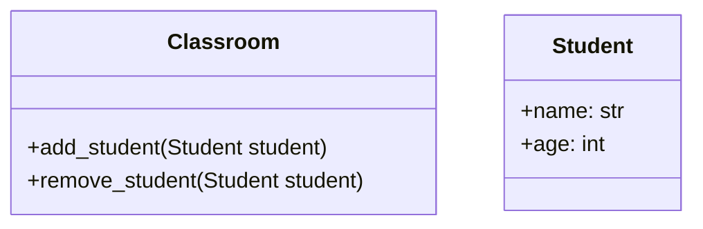

# Data Structure: Linked Lists
Provides an overview of fundamental data structures:
- Arrays
- Linked Lists

During the session, you will implement a simple linked list by ensuring it passes the unit tests.

## Requirements
Ensure you have `PyCharm` or your favorite IDE configured for Python - DO NOT HAVE COPILOT OR ANY AI ACTIVE.

## Warm up
This exercise is to help you revise and build your basic Python skills. There are some rules to this warm up:
- No AI
- No Google

So what does that leave you with? Your peers
1. If you don't know how to do something, ask the person next to you
2. If they don't know, ask your lecturer (or the person sitting next to them)

In general - help each other!

### Set up
-  Create a new python project in PyCharm
-  Use a `.venv` in your project
-  Ensure AI features are disabled

### Specification
Create a simple python application that defines a classroom that contains students. A classroom shall be able to add and remove students.

The following UML diagram describes the system:

Create the following files:
- `classroom.py`
- `student.py`
- `main.py`

In the `main.py` file, create a `Classroom` and add three students to it: you, the person to the left of you, and the person to the right of you.

When you finish: help the person next to you.

### Lesson Preamble
Understand: what is an array and what are it's benefits and drawbacks.

Check that you can:
- Explain what an array is in terms of organization in memory
- Explain how it afford random access in constant time
- Identify cases where sequential iteration is required
- Understand why and when arrays must be resized

### Main Lesson

- Understand linked list and their benefits and drawbacks compared to arrays.

- Complete the **Simple Linked List** Exercism by passing the (unit tests)[./exercism/simple_linked_list_test.py]
